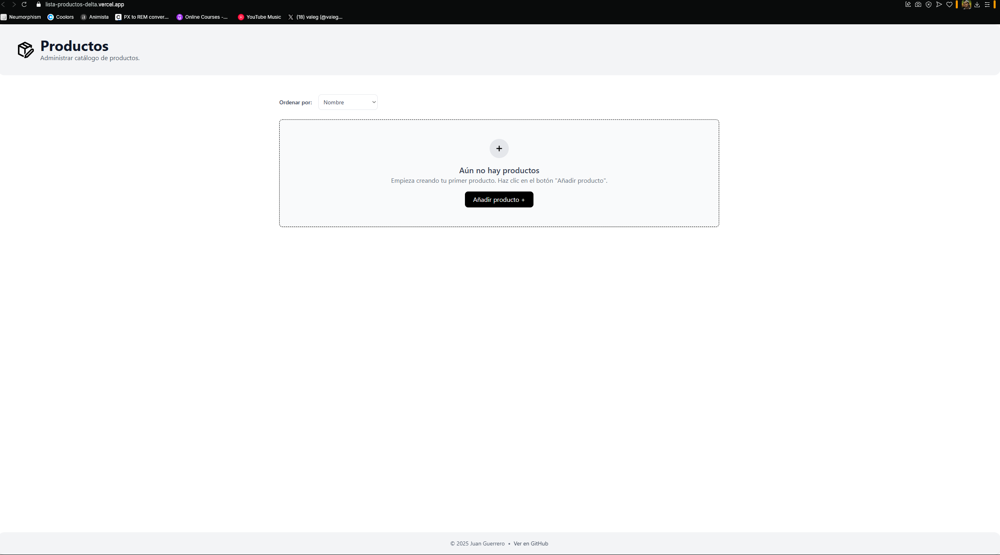
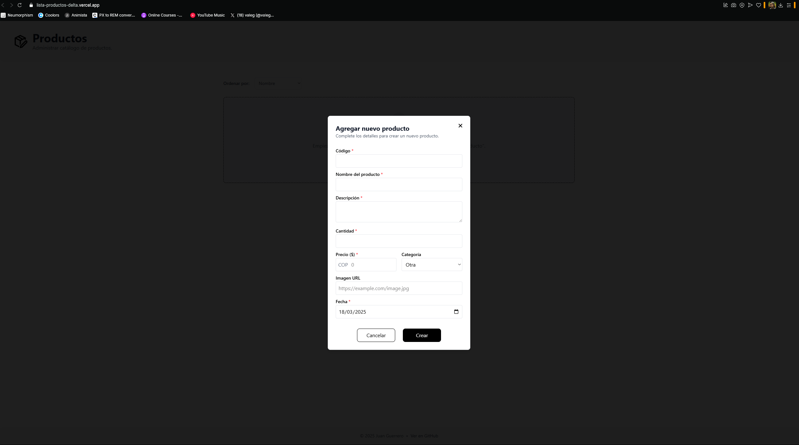
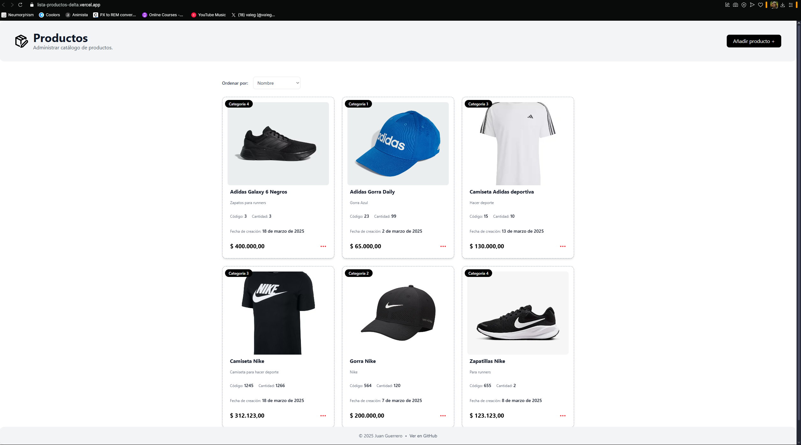

# Lista de Productos

Este es un proyecto desarrollado con [Next.js](https://nextjs.org), utilizando estilos de [Tailwind CSS](https://tailwindcss.com) y elementos gráficos de [Iconify](https://iconify.design/).

## Descripción
La interfaz gráfica cuenta con tres vistas principales:
1. **Sin productos**: Pantalla inicial sin elementos agregados.
2. **Cuadro de diálogo para agregar productos**.
3. **Visualización en formato de cuadrícula** con tarjetas que muestran la información del producto.  
   - Al hacer clic en los tres puntos rojos, se puede eliminar un producto.

## Capturas de pantalla

### Vista sin productos

### Cuadro de diálogo para añadir productos

### Visualización de productos en cuadrícula

## Despliegue
Este proyecto ha sido desplegado en [Vercel](https://vercel.com).

---
📌 **Tecnologías utilizadas:**
- Next.js
- Tailwind CSS
- Iconify
- Vercel (para el despliegue)
